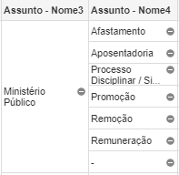

```{r setup, include=FALSE}
knitr::opts_chunk$set(
  echo = FALSE,
  fig.align = "center",
  out.width = "90%",
  message = FALSE,
  warning = FALSE
)

cores_abj <-  viridis::viridis(2, 1, .2, .8)
```

# Orientações gerais

- Formem grupos de 5 alunos. Todas as questões deverão ser respondidas nestes grupos;
- Os grupos terão de 40 minutos a 1 hora para responder às questões;
- Um único aluno será encarregado de anotar as respostas às questões discutidas no grupo;
- Depois das discussões em grupo, retornaremos à sala para discutir as questões conjuntamente;
- Outro aluno, que não aquele encarregado de anotar, deverá ler as respostas quando discutidas em grupo.

## I) Investigando o processo de geração de dados dos assuntos (e classes) processuais.

```{r r-assuntos-tjam}
assuntos_tjam <- abjData::assuntos |>
  dplyr::filter(tribunal == "TJAM") |>
  dplyr::group_by(assunto_nome1, assunto_nome2, assunto_nome3, assunto_nome4, assunto_nome5, assunto_nome6) |>
  dplyr::summarise(
    n = sum(total)
  ) |>
  dplyr::ungroup()
```

#### Vamos usar, para esse exercício, uma base de dados que está no Drive:

https://docs.google.com/spreadsheets/d/1W0a0MPpszNYEbS6x8ytDwYF78rcU8_qhgOO4ke22sSw/edit#gid=0

#### Essa planilha contém a contagem de todos a contagem de todos os assuntos extraídos do Esaj do TJAM, entre os anos de 2014 e 2019. Poderíamos fazer uma planilha igual para as classes, pois o raciocínio será o mesmo. 

#### a) Os assuntos estão padronizados, ou para designar um mesmo assunto há uma série grafias distintas? Por que isso aconteceu?

Os assuntos estão padronizados. Isso acontece graças às [Tabelas Processuais Unificadas](https://www.cnj.jus.br/sgt/consulta_publica_assuntos.php)

#### b) Na planilha, existe uma série de células cuja informação é apenas um traço "-". O que isso significa?

Isso significa que não há classificação de nível mais específico. 

#### c) Veja a imagem abaixo

```{r, out.width="100%"}

```

#### Nesta imagem, o Assunto - Nome4 é o nível de assunto mais específico que essa árvore consegue chegar. O que significa o "-" nesta coluna? 

#### d) Com base no que foi discutido no item (c), discuta possíveis problemas no gráfico abaixo. Podemos afirmar com certeza que "Remuneração" é o assunto mais frequente a respeito do Ministério Público?

```{r fig-assuntos-mp}
assuntos_tjam |> 
  dplyr::filter(assunto_nome3 == "Ministério Público") |> 
  dplyr::select(assunto_nome3, assunto = assunto_nome4, n) |> 
  dplyr::arrange(desc(n)) |> 
  dplyr::mutate(
    assunto = forcats::fct_inorder(assunto),
    assunto = forcats::fct_relevel(assunto, "-", after = Inf),
    prop = n/sum(n),
    perc = formattable::percent(prop),
    col_dif = assunto == "-"
  ) |> 
  ggplot2::ggplot() +
  ggplot2::aes(x = assunto, y = n, fill = col_dif, label = perc) +
  ggplot2::geom_col(show.legend = FALSE) +
  ggplot2::geom_label(fill = "white") +
  ggplot2::scale_fill_manual(values = c(cores_abj[1], "gray70")) +
  ggplot2::scale_x_discrete(labels=scales::label_wrap(20)) +
  ggplot2::labs(
    title = 'Sub-assuntos dentro de "DIREITO ADMINISTRATIVO E OUTRAS MATÉRIAS\nDE DIREITO PÚBLICO" > "Agentes Políticos" > "Ministério Público"',
    x = 'Assuntos',
    y = "Quantidade de casos"
  )
```

Nós não sabemos a real distribuição dos casos marcados com "-". Isso dificulta a análise. Será que todos os casos que estão em "-" deveriam ser classificados como "Promoção", sendo, portanto, "Promoção" o assunto mais frequente? 

## II) Investigando o processo de geração de dados do valor da causa


## III) Investigando o processo de geração de dados de datas

### a) Data de distribuição

### b) Data de decisões liminares

