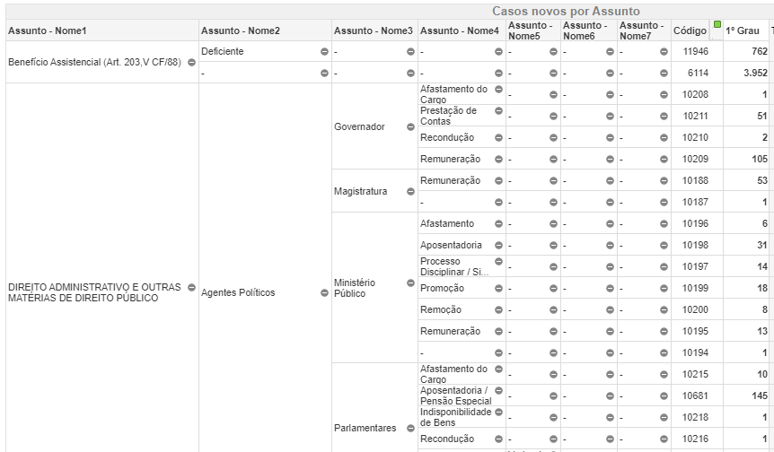
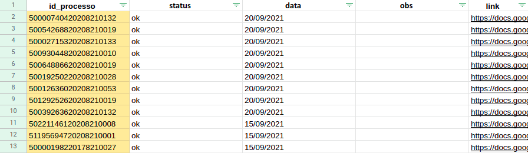

```{r setup, include=FALSE}
knitr::opts_chunk$set(
  echo = FALSE,
  fig.align = "center",
  out.width = "90%",
  message = FALSE,
  warning = FALSE
)
xaringanExtra::use_panelset()
```

---
# O que vamos ver hoje?

Hoje vamos ver uma técnica de pesquisa muito utilizada na ABJ. É a técnica que utilizamos nas nossas pesquisas do tipo Observatórios. Escolhemos apresentar esta técnica de pesquisa porque: (1) ela é a mais reprodutível por vocês, uma vez que não exige conhecimentos técnicos de programação tão avançados; (2) ela vai suscitar várias questões de metodologia importantes, o que será bom para testarmos os conhecimentos que vimos até aqui. 

É importante salientar que este modelo de pesquisa é o modelo que vocês terão de seguir para realizar o trabalho final. Na aula que vem, teremos uma aula específica para que cada um de vocês planeje a metodologia de pesquisa de vocês. Essa metodologia que vocês irão utilizar deve seguir a técnica apresentada na aula de hoje. 

---
# Visão geral da técnica

1. Listagem de processos
  - Definição de escopo
  - Envolve questões de amostragem
1. Classificação dos processos
  - Envolve processo de geração de dados (PGD)
  - Como usar o Direito para operacionalizar conceitos?
1. Análises
  - Qual o papel do Direito nas análises?
  
---
class: middle, center
# Delimitação de escopo e Listagem de processos

---
## Delimitação de escopo

1. Que instituições eu vou pesquisar?
  - Judiciário?
      - TJs? Primeira ou segunda instância? Tribunais Superiores? TRT? Justiça Federal? 
  - Ministério Público?
  - Defensoria Pública?
  - Administração Pública?
1. Em que locais eu vou pesquisar?
  - Nacional, regional ou local?
  - Se for local, que locais? Por que eu faria uma pesquisa em São Paulo ou em Salvador? O que essa localidade muda? Tanto faz? Que critério usar para decidir?
1. Que ações eu vou pesquisar? 
1. A pesquisa será retrospectiva ou prospectiva?
1. Em que período eu vou pesquisar?

**Nos exemplos, vamos trabalhar apenas com pesquisas sobre o Judiciário, nos TJs, em que o escopo é sempre local e retrospectivo.**
---
## Listagem de processos

#### O que é?

A listagem de processos é uma etapa da metodologia em que elaboramos uma lista com ***TODOS*** os processos que estão dentro do nosso escopo. A definição do escopo, portanto, constitui a nossa listagem de processos. 

A ideia é que a gente liste todos os processos mesmo que estejam dentro do nosso escopo, mas nunca teremos como saber se, de fato, conseguimos fazer isso. 

#### Para que serve?

1. É somente a partir da listagem dos processos que podemos tomar a decisão de se vamos analisar todos os processos da base ou se vamos amostrá-la, ou seja, se a pesquisa será populacional ou amostral. 
1. Caso a gente decida a amostrar os processos, é somente com a listagem dos processos que poderemos realizar esse procedimento, pois é somente com o número total de processos que podemos (a) estipular o número de processos que devem ser amostrados; (b) realizar uma amostragem aleatória simples

---
## Listagem de processos e o escopo temporal
### Pesquisa retrospectiva

- Neste caso, a listagem de processos ocorre nos sistemas de Consulta de Julgados.
- Esse procedimento é possível de ser realizado sem técnicas de computação, mas isso depende da quantidade de processos de que estamos falando, bem como da 

### Pesquisa prospectiva

- Neste caso, a listagem de processos ocorre via Diários de Justiça.
- Esse procedimento só pode ser realizado com técnicas muito avançadas de computação. Então não vamos tratar disso

---
## Os quatro sistemas dos TJs

|Nome do sistema|Sigla|O que encontrar?|
|:-------------:|:---:|:--------------:|
|Consulta de julgados do primeiro grau|cjpg|Pesquisa de sentenças por palavra-chave, classe, assunto e tempo|
|Consulta de julgados do segundo grau|cjsg|Pesquisa de acórdãos por palavra-chave, classe, assunto e tempo|
|Consulta de processos do primeiro grau|cpopg|Pesquisa por id de processo na primeira instância (já concluído ou em andamento)|
|Consulta de processos do segundo grau|cposg|Pesquisa por id de processo na primeira instância (já concluído ou em andamento)|

#### Algumas ressalvas
1. Essa nomenclatura é usada pelos sistemas do tipo e-saj. PJe não usa essa nomenclatura. 
2. Nem todos os sistemas do tipo e-saj possuem os 4 sistemas. Principalmente o cjpg é o que mais falta.
3. Isso varia muito de tribunal para tribunal, e de Estado para Estado

---
## Relação entre o escopo e a busca de processos

```{r, out.width="200%"}
knitr::include_graphics("img/cjpg.png")
```

---
## Pesquisa livre: definido palavras-chave

O campo que normalmente mais preenchemos é o campo da pesquisa livre. Há algumas orientações gerais para definir palavras-chave:
1. Você deverá começar sempre repertório próprio de palavras-chave para encontrar os primeiros processos
2. Mas saiba que esse repertório inicial é insuficiente! Você vai aprimorar esse repertório depois de pesquisar pelos primeiros processos e, a partir deles, encontrar novas palavras-chave relevantes
3. Você deve balancear a parcimônia x precicsão. As palavras-chave devem ser as mais genéricas e simples possíveis, a fim de não deixar nenhum processo de fora. Mas elas devem também ser as mais precisas possíveis para que a listagem de processos não tenha um monte de "lixo". 

Exemplo: Quando fomos estudar a judicialização entorno de conflitos imobiliários de concessão de alvará de construção, iniciamos com a palavra-chave "alvará de construção". Ao fim, havíamos 12 expressões, pois as sentenças podiam se referir a esse mesmo documento como "alvará de execução", "alvará de aprovação", "alvará de edificação" e, além disso, a palavra "alvará" poderia ser trocada por "licença" ou "licenciamento". Fazendo a análise combinatória disso, ficamos com 3 tipos de documentos (alvará, licença ou licenciamento) e 4 tipos de atividades (construção, execução, aprovação e edificação), totalizando 12 palavras-chave possíveis. 

---
## Classe e Assunto - TPUs

Quando a gente vai pensar em Classe e Assunto que queremos dentro do escopo, temos de saber quais são as [classes](https://www.cnj.jus.br/sgt/consulta_publica_classes.php) e [assuntos](https://www.cnj.jus.br/sgt/consulta_publica_assuntos.php) possíveis. Para isso temos as Tabelas Processuais Unificadas (TPUs). 

Tem algumas informações que são importantes de sabermos sobre as TPUs:

1. Quem elabora as TPUs? O CNJ
1. Quem preenche as classes e assuntos de cada processo? Os advogados
1. Existe revisão desse preenchimento? Sim, o juiz pode pedir a revisão disso
1. Como esse preenchimento é feito? O advogado preenche qualquer classe e assunto, podendo inclusive colocar classes e assuntos mais "genéricos" do que o possível. 

---
## Classe e Assunto - Cifra Oculta

```{r, out.width="100%"}

```

---
## Classe e Assunto - Cifra Oculta

```{r, out.width="60%"}
knitr::include_graphics("img/cifra_oculta_especifico.png")
```

---
## Produto final

O produto final da listagem de processos deve ser uma planilha, em que cada linha é um processo. 

```{r, out.width="100%"}

```

---
class: middle, center
# Classificação de processos

---
## Classificação de processos - Criação do formulário

- Recomendamos o uso da tecnologia Google Forms.
- A **unidade de resposta será o processo**, o que obriga que a primeira pergunta do formulário seja sempre o número do processo e faz com que cada pergunta seja pensada a partir do ponto de vista do processo.
- Recomendamos também que a segunda pergunta do formulário seja uma pergunta de escopo: o processo está dentro do escopo? Se sim, preencha o formulário normalmente, se não, encerre o formulário. 
  - Isso é importante porque a listagem de processos pode ter identificado processos fora de escopo, mas é importante registrar que um determinado processo já foi respondido.
- Evite perguntas que sejam respondidas com textos livres. Opte, no lugar, por uma lista de respostas, com a possibilidade de inserir "Outros".
- Pense na **estrutura lógica do formulário**. A estrutura lógica serve para evitar que algumas perguntas sejam sequer realizadas. 
 - Exemplo: não faz sentido perguntar se um plano de recuperação judicial foi aprovado se ainda não foi deferido o pedido de recuperação.

---
## Classificação de processos - Criação do formulário

- Tente, ao máximo, criar perguntas obrigatórias. Isso evita lacunas na pesquisa
- Para as perguntas que não serão obrigatórias, pense de antemão o que vai significar que a pergunta foi deixada em **branco**: (a) informações não encontradas? (b) a pergunta não se aplica? 
- Documente com muito detalhamento como o formulário está sendo construído! O formulário faz parte do **processo de geração de dados**. É por meio dele que os processos serão convertidos em dados.

---
## Classificação de processos - Pré-teste

Com o formulário pronto, devemos testá-lo. Fazemos isso em um procedimento chamado pré-teste. 
1. Amostre entorno de 30 a 40 processos para fazer o pré-teste
1. O pré-teste deve ser realizado por vários pesquisadores, e não só um. A ideia é que toda a equipe de pesquisa responda a todos os processos, para, ao fim, comparar as respostas de cada processo. Essa comparação dirá respeito muito mais ao formulário do que à interpretação subjetiva dos pesquisadores.
1. A comparação deverá levar a conclusões a respeito de cada uma das perguntas do formulário. Assim, para cada pergunta, a equipe de pesquisa deverá concluir que, ou a pergunta está boa e não precisa ser alterada, ou que ela não está boa e precisa de algumas modificações. Há duas respostas possíveis que podemos dar a um problema no formulário

---
## Classificação de processos - Pré-teste

### O que fazer quando as perguntas não estão boas?
1. Padronização: Mantém a pergunta igual, mas padroniza a forma como ela vai ser respondida. Essa padronização pode ficar descrita no próprio enunciado da questão, ou em um documento a parte. 
1. Mudanças no formulário: Realiza alguma modificação no formulário
    - Para perguntas de múltipla escolha é possível que no pré-teste tenham sido identificadas opções que não estavam contempladas ainda pelo formulário.
    - A pergunta foi deixada como obrigatória, mas há casos em que não foi possível encontrar essa resposta.
    - A pergunta era um texto aberto, mas foi possível perceber um padrão de respostas durante o pré-teste, sendo possível a substituição da pergunta em texto aberto por uma pergunta múltipla escolha.
    - Uma pergunta foi feita quando não deveria ter sido feita, sendo necessário aprimorar o controle lógico do formulário.

---
## Classificação de processos - Pré-teste

### O que fazer quando as perguntas não estão boas?
1. Padronização: Mantém a pergunta igual, mas padroniza a forma como ela vai ser respondida. Essa padronização pode ficar descrita no próprio enunciado da questão, ou em um documento a parte. 
1. Mudanças no formulário: Realiza alguma modificação no formulário
    - A ausência de alguns documentos impossibilita o preenchimento dos formulários. Neste caso, pode ser criada uma opção para "O processo está fora do escopo?", cuja resposta seja: "Não, mas não há dcumentos para preencher", ou ainda, realiza-se dois formulários distintos. Como o problema de ausência de documentos normalmente acontece em processos físicos, então pode existir um formulário para processos digitais e outro para processos físicos. 

---
## Classificação de processos - Preenchendo o formulário

Com o formulário corrigido pelo pré-teste, iniciamos o seu preenchimento. Cada preenchimento representa um processo. Neste momento, os processos estão sendo convertidos em dados. 
- Essa é a etapa mais longa da pesquisa. Ela deverá ser bem planejada, pois, caso contrário, a pesquisa não terá dados suficientes para ser realizada. 

---
## Classificação de processos - Controle de inconsistências

A criação do formulário, ao lado do pré-teste, devem reduzir ao máximo a quantidade de inconsistências. Entretanto, no momento do preenchimento, algumas inconsistências aparecem. A equipe de pesquisa deverá realizar um esforço para identificar e resolver essas inconsistências. A seguir temos algumas inconsistências frequentes. 
1. Datas mal preenchidas. É possível que na hora de preencher as informações de um processo, tenha havido um erro de digitação, fazendo com que, por exemplo, a data da sentença seja _anterior_ à data de distribuição do processo. Isso precisa ser corrigido. 
1. Identificação de erros lógicos posteriores. Idealmente, devemos identificar os erros lógicos na hora de elaboração do formulário. Entretanto, algum detalhe pode ter passado desapercebido, de forma que ele seja identificado somente depois ou durante o preenechimento do formulário. 

É muito importante evitar ao máximo alterar a estrutura do formulário. É possível alterar a resposta a um caso, mas não mude o formulário, isso vai mexer com a estruutra de dados. 

---
class: middle, center

# Análises

---
## Como analisar?

#### Ferramentas

É preciso ter algum software para analisar os dados. Na ABJ utiizamos muito o R. Mas é possível também utilizar o próprio Excel, ou Google Sheets, ou outros softwares de programação, tais como Python ou Stata. 

#### Tipos de análise

1. Análises quantitativas
  1. Gráfico de barras
  1. Tabelas de frequência
  1. Séries temporais
  1. Histogramas
  1. Análise de sobrevivência
2. Métodos mistos
  1. Método convergente em paralelo
  1. Método sequencial exploratório
  1. Método sequencial explanatório

---
## Tipos de análise
#### Métodos mistos (Creswell, 2013)
1. Método convergente em paralelo: dados quantitativos e qualitativos são levantados ao mesmo tempo e comparados.
1. Método sequencial exploratório: dados qualitativos geram perguntas que são testadas por análises quantitativas.
1. **Método sequencial explanatório: dados quantitativos são completados e interpretados com análises qualitativas.**


Creswell, John W. **Research Design: Qualitative, Quantitative, and Mixed Methods Approaches**. Sage publications. 2013
---
## Tipos de análise

```{r}
DiagrammeR::grViz(
'digraph G {
  rankdir = LR

    subgraph cluster_one{
      peripheries=1
      
      label = "Método sequencial explanatório";
      rank = same;

      node [shape = box]
        quant2 [label = "Quantitativo"];
        quali2 [label = "Qualitativo"]
  
      node [shape = ellipse, style = filled, fillcolor = "#7AD151"]
        interp2 [label = "Interpretação\ndos Dados"]
    
      quali2->quant2 quant2->interp2
    }
    
    subgraph cluster_two{
      peripheries=1
      
      label = "Método sequencial exploratório";
      rank = same;

      node [shape = box]
        quant1 [label = "Quantitativo"];
        quali1 [label = "Qualitativo"]
  
      node [shape = ellipse, style = filled, fillcolor = "#7AD151"]
        interp1 [label = "Interpretação\ndos Dados"]
    
      quant1->quali1 quali1->interp1
    }
    
    subgraph cluster_three{
      peripheries=1
      
      label = "Método convergente em paralelo";
      rank = same;

      node [shape = box]
        quant3 [label = "Quantitativo"];
        quali3 [label = "Qualitativo"]
  
      node [shape = box]
      data_conv [label = "Convergência\nde Dados"]
      
      node [shape = ellipse, style = filled, fillcolor = "#7AD151"]
        interp3 [label = "Interpretação\ndos Dados"]
    
      quant3->data_conv quali3->data_conv data_conv->interp3
    }
}')
```
