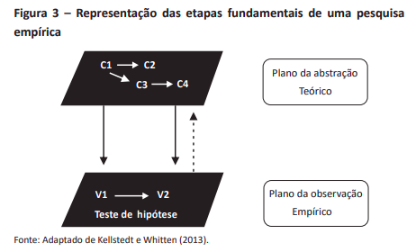

```{r setup, include=FALSE}
knitr::opts_chunk$set(
  echo = FALSE,
  fig.align = "center",
  out.width = "90%",
  message = FALSE,
  warning = FALSE
)
xaringanExtra::use_panelset()
```


# Objetivos de aula
#### 1. Aprender as questões envolvidas na definição de escopo: __<span style="color:#3B0F70;">marca azul</span>__

#### 2. Aprender a discutir criticamente a operacionalização de conceitos: __<span style="color:#7AD151;">marca verde</span>__

---
class: middle, center, tema1
# Definição de escopo

---
class: tema1
# Escopo temporal

```{r, out.width="90%"}
knitr::include_graphics("img/tempos.png")
```

(1) Prospectivo e retrospectivo

(2) Apenas prospectivo

(3) Apenas retrospectivo

---
class: tema1
# Escopo temporal

```{r, out.width="90%"}
knitr::include_graphics("img/tempos.png")
```

(4) Nenhum dos dois, mas poderia ser capturado por atividade no período.

(5 e 6) fora do escopo.

(7) Nenhum dos dois tipos e não poderia ser capturado (ficou inativo no período).

---
class: tema1

# Escopo geográfico

Está ligado à escolha do tribunal a se estudar, ou da instituição. 
- TJs
- STJ
- JF
- TRF
- STF
- TRT

Não precisamos estudar sempre tribunais judiciais, podemos estudar tribunais administrativos também:
- Conselho dos Contribuintes
- Tribunal de Impostos e Taxas
- CARF
- CVM
- CRSFN

E não precisamos nem estuar tribunais, podemos estudar instituições, tais como a Defensoria Pública ou o Ministério Público

---
class: middle, center, tema2
# Operacionalização de conceitos


---
class: tema2

# Do plano abstrato ao empírico

```{r, out.width="90%"}

```
##### Fonte: SILVA, Glauco Peres. Desenho de Pesquisa. Brasília: Enap. 2018

--- 
class: middle, center

# Exercícios

Vamos fazer exercícios para testar isso.
