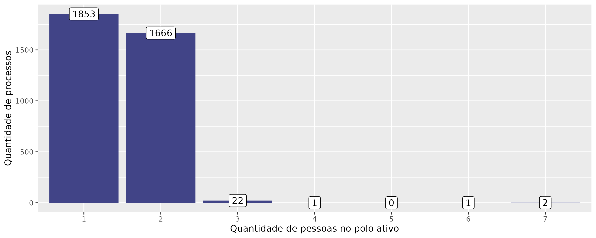
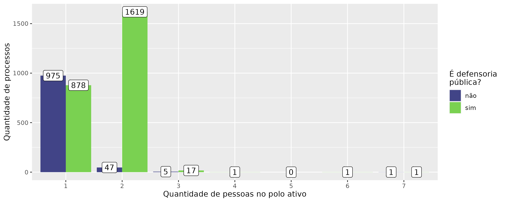

```{r setup, include=FALSE}
knitr::opts_chunk$set(
  echo = FALSE,
  fig.align = "center",
  out.width = "90%",
  message = FALSE,
  warning = FALSE
)
xaringanExtra::use_panelset()
```

class: middle, center

# Aula I de Metodologia
## Definição de escopo e operacionalização de conceitos

---
# Objetivos de aula
#### 1. Aprender as questões envolvidas na definição de escopo: __<span style="color:#3B0F70;">marca azul</span>__

#### 2. Aprender a discutir criticamente a operacionalização de conceitos: __<span style="color:#7AD151;">marca verde</span>__

---
class: middle, center, tema1
# Definição de escopo

---
class: tema1
# Escopo temporal

```{r, out.width="90%"}
knitr::include_graphics("img/tempos.png")
```

(1) Prospectivo e retrospectivo

(2) Apenas prospectivo

(3) Apenas retrospectivo

---
class: tema1
# Escopo temporal

```{r, out.width="90%"}
knitr::include_graphics("img/tempos.png")
```

(4) Nenhum dos dois, mas poderia ser capturado por atividade no período.

(5 e 6) fora do escopo.

(7) Nenhum dos dois tipos e não poderia ser capturado (ficou inativo no período).

---
class: tema1

# Escopo geográfico

Está ligado à escolha do tribunal a se estudar, ou da instituição. 
- TJs
- STJ
- JF
- TRF
- STF
- TRT

Não precisamos estudar sempre tribunais judiciais, podemos estudar tribunais administrativos também:
- Conselho dos Contribuintes
- Tribunal de Impostos e Taxas
- CARF
- CVM
- CRSFN

E não precisamos nem estuar tribunais, podemos estudar instituições, tais como a Defensoria Pública ou o Ministério Público

---
class: middle, center, tema2
# Operacionalização de conceitos


---
class: tema2

# Do plano abstrato ao empírico

```{r, out.width="90%"}
knitr::include_graphics("img/operacionalizacao.png")
```
##### Fonte: SILVA, Glauco Peres. Desenho de Pesquisa. Brasília: Enap. 2018

---
class: middle, center

# Exercícios

---
class: middle, center

# Aula II de Metodologia
## Perguntas de pesquisa e Processo de geração de dados

---
# Objetivos de aula
#### 1. Aprender as diferenças das perguntas no Direito para as perguntas na Estatística: __<span style="color:#3B0F70;">marca azul</span>__

#### 2. Aprender a discutir criticamente os processos de geração de dados: __<span style="color:#7AD151;">marca verde</span>__

---
class: middle, center, tema1
# Pergunta de pesquisa

---
class: tema1
## Diferença 1: Perguntas normativas x Perguntas descritivas

#### Perguntas normativas
1. Quem controla jurisdicionalmente a discricionariedade no Brasil? Qual é o objeto do controle? Como deve ser a discricionariedade controlada?
2. O que é o interesse público? 
3. Como devemos tratar as demandas em direito à saúde, elas "devem  ser  consideradas  como  ações  individuais  e  sujeitas  às  regras  estabelecidas  no  Código  de  Processo  Civil  ou  deveriam  ser  tratadas  como  coletivas  e  sujeitas  às normas  do  Código  de  Defesa  do  Consumidor  e  da  Lei  da  Ação  Civil  Pública? Ou deveriam receber um regime legal intermediário mais adequado?"

#### Perguntas descritivas
1. Quais os "impactos da MPV 1.040/2021 no tempo de abertura de empresas"?
2. "Como os agentes tomadores de decisão reagiram à lei 11.343/2006? O padrão das apreensões mudou depois de 2006?"
---
class: tema1
## Diferença 2: Tese x Hipótese

### Tese

No Direito, a gente tende a dizer qual é a tese e elaborar o caminho até ela posteriormente, dentro dos limites que a lei permitir. 

### Hipótese

Na Estatística, a gente elabora uma hipótese e utiliza um caminho rígido para *verificar* se a hipótese é correta ou não.

---
class: middle, center, tema2
# Processo de geração de dados

---
class: , middle, center, tema2

### A seguir, vamos ver um exemplo. O exemplo veio de um estudo da ABJ, sobre a judicialização da saúde na Justiça Federal do Ceará. 

---
class: middle, center, tema2

#### Eu posso afirmar com certeza que existem aproximadamente a mesma quantidade de processos com 1 e com 2 partes?

```{r, out.width="100%"}

```

---
class: tema2

# Como esse dado foi gerado?

- Os dados foram coletados automaticamente do site da Justiça Federal do Ceará
- Na Justiça Federal, os dados apareciam da seguinte maneira:

```{r, out.width="90%"}

```

- Então o scraper que criamos extraía o nome da parte e o seu tipo de participação
- Consideramos como polo ativo apenas as partes classificadas como “Impetrante”, “Autor”, “Embargante”, “Parte Autora”, “Exequente” e “Requerente”.

#### Como vocês avaliaram o gráfico, então, sabendo disso?

---
class: middle, center, tema2

#### Eu posso afirmar com certeza que existem aproximadamente a mesma quantidade de processos com 1 e com 2 partes?

```{r, out.width="100%"}

```
---
class: tema2
## Processo de Geração de Dados (PGD)

### Como os dados foram gerados?

O processo de geração de dados é a forma, por meio da qual, determinada informação foi criada. É extremamente importante documentar e reportar todos esses processos, para que os pares acadêmicos possam validar a pesquisa e as escolhas metodológicas feitas nela. **O processo de geração de dados é importante porque:**

> sem essa informação, nós não podemos determinar se utilizar processos padrões de análise de dados irá produzir inferências enviesadas. Somente ao saber do processo por meio do qual os dados foram gerados é que nós conseguiremos produzir uma inferência causal ou descritiva válida.

KING, G.; KEOHANE, R. O.; VERBA, S. **Designing Social Inquiry: Scientific Inference in Qualitative Research**. Princeton: Princeton University Press. 1994, p. 23. 

---
class: middle, center

# Exercícios
