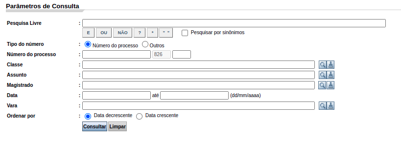

```{r setup, include=FALSE}
knitr::opts_chunk$set(
  echo = FALSE,
  fig.align = "center",
  out.width = "90%",
  message = FALSE,
  warning = FALSE
)
xaringanExtra::use_panelset()
```

---
# O que vamos ver hoje?

Hoje vamos ver uma técnica de pesquisa muito utilizada na ABJ. É a técnica que utilizamos nas nossas pesquisas do tipo Observatórios. Escolhemos apresentar esta técnica de pesquisa porque: (1) ela é a mais reprodutível por vocês, uma vez que não exige conhecimentos técnicos de programação tão avançados; (2) ela vai suscitar várias questões de metodologia importantes, o que será bom para testarmos os conhecimentos que vimos até aqui. 

É importante salientar que este modelo de pesquisa é o modelo que vocês terão de seguir para realizar o trabalho final. Na aula que vem, teremos uma aula específica para que cada um de vocês planeje a metodologia de pesquisa de vocês. Essa metodologia que vocês irão utilizar deve seguir a técnica apresentada na aula de hoje. 

---
# Visão geral da técnica

1. Listagem de processos
  - Definição de escopo
  - Envolve questões de amostragem
1. Classificação dos processos
  - Envolve processo de geração de dados (PGD)
  - Como usar o Direito para operacionalizar conceitos?
1. Análises
  - Qual o papel do Direito nas análises?
  
---
class: middle, center
# Delimitação de escopo e Listagem de processos

---
## Delimitação de escopo

1. Que instituições eu vou pesquisar?
  - Judiciário?
      - TJs? Primeira ou segunda instância? Tribunais Superiores? TRT? Justiça Federal? 
  - Ministério Público?
  - Defensoria Pública?
  - Administração Pública?
1. Em que locais eu vou pesquisar?
  - Nacional, regional ou local?
  - Se for local, que locais? Por que eu faria uma pesquisa em São Paulo ou em Salvador? O que essa localidade muda? Tanto faz? Que critério usar para decidir?
1. Que ações eu vou pesquisar? 
1. A pesquisa será retrospectiva ou prospectiva?
1. Em que período eu vou pesquisar?

Nos exemplos, vamos trabalhar apenas com pesquisas sobre o Judiciário, nos TJs, em que o escopo é local e retrospectivo.
---
## Listagem de processos

#### O que é?

A listagem de processos é uma etapa da metodologia em que elaboramos uma lista com ***TODOS*** os processos que estão dentro do nosso escopo. A definição do escopo, portanto, constitui a nossa listagem de processos. 

A ideia é que a gente liste todos os processos mesmo que estejam dentro do nosso escopo, mas nunca teremos como saber se, de fato, conseguimos fazer isso. 

#### Para que serve?

1. É somente a partir da listagem dos processos que podemos tomar a decisão de se vamos analisar todos os processos da base ou se vamos amostrá-la, ou seja, se a pesquisa será populacional ou amostral. 
1. Caso a gente decida a amostrar os processos, é somente com a listagem dos processos que poderemos realizar esse procedimento, pois é somente com o número total de processos que podemos (a) estipular o número de processos que devem ser amostrados; (b) realizar uma amostragem aleatória simples

---
## Listagem de processos e o escopo temporal
### Pesquisa retrospectiva

- Neste caso, a listagem de processos ocorre nos sistemas de Consulta de Julgados.
- Esse procedimento é possível de ser realizado sem técnicas de computação, mas isso depende da quantidade de processos de que estamos falando, bem como da 

### Pesquisa prospectiva

- Neste caso, a listagem de processos ocorre via Diários de Justiça.
- Esse procedimento só pode ser realizado com técnicas muito avançadas de computação. Então não vamos tratar disso

---
## Os quatro sistemas dos TJs

|Nome do sistema|Sigla|O que encontrar?|
|:-------------:|:---:|:--------------:|
|Consulta de julgados do primeiro grau|cjpg|Pesquisa de sentenças por palavra-chave, classe, assunto e tempo|
|Consulta de julgados do segundo grau|cjsg|Pesquisa de acórdãos por palavra-chave, classe, assunto e tempo|
|Consulta de processos do primeiro grau|cpopg|Pesquisa por id de processo na primeira instância (já concluído ou em andamento)|
|Consulta de processos do segundo grau|cposg|Pesquisa por id de processo na primeira instância (já concluído ou em andamento)|

#### Algumas ressalvas
1. Essa nomenclatura é usada pelos sistemas do tipo e-saj. PJe não usa essa nomenclatura. 
2. Nem todos os sistemas do tipo e-saj possuem os 4 sistemas. Principalmente o cjpg é o que mais falta.
3. Isso varia muito de tribunal para tribunal, e de Estado para Estado

---
## Relação entre o escopo e a busca de processos

```{r, out.width="200%"}

```

---
## Classe e Assunto e as TPUs


---
## Listagem de processos para pesquisas prospectivas

---
class: middle, center
# Classificação de processos

---
## Classificação de processos - Criação do formulário

---
## Classificação de processos - Pré-teste

---
## Classificação de processos - Preenchendo o formulário

---
## Classificação de processos - Controle de inconsistências


